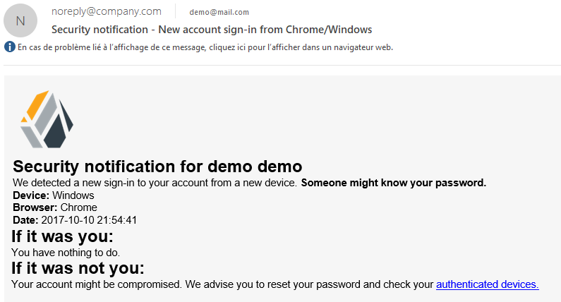

# openam-device-warning-mail

This is an implementation on how to send a mail to the user in case a sign-in occurs using a new device. This module is intended to be used after the OpenAM DeviceId Save module.

This module has been tested on OpenAM 13.0.0.

## Installation

```bash
git clone git@github.com:mirzlab/openam-device-warning-mail.git
cd openam-device-warning-mail
mvn clean package
```

Copy the *target/openam-device-warning-mail-1.0.0.jar* into the OpenAM *WEB-INF/lib/* folder.

Register the module using the following *ssoadm* commands:

```bash
ssoadm create-svc -u amadmin -f pwdfile -X src/main/resources/amAuthDeviceWarningMailModule.xml
ssoadm register-auth-module -u amadmin -f pwdfile -a com.mirzlab.openam.DeviceWarningMailModule
```

Restart your container.

## Configuration

Specify the path to the mail template file inside the module configuration (using OpenAM admin console or using ssoadm).

A default mail template file is provided inside the project: mailTemplate.txt

**You can use the following variables inside the mail subject and template file:**

- browser: returns the browser used to authenticate (based on User-Agent header)
- device: returns the device name used to authenticate (based on User-Agent header)
- *attribute*: returns the attribute value of the user

To use these variables, you must use the following syntax: %{variable} (i.e %{uid} returns the uid attribute of the user)
 
Place the module after the *DeviceId Save* module. Your authentication chain can be configured as follow :

1. LDAP - Requisite
2. DeviceId Match - Sufficient
3. DeviceId Save - Required
4. Device Warning Notification - Required

## Let's test

Test that the module is working by using the created authentication chain:

```
https://openam.example.com:8443/openam/UI/Login?service=DeviceWarningNotification
```

After entering the username and password, if the device is unknown, the user is asked to register the device and a notification mail is sent to his mail address.

Default mail template result :


